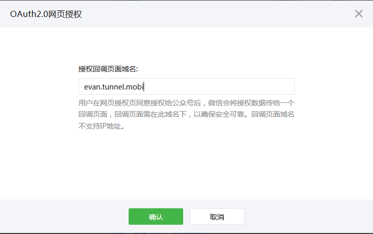

##redirect_uri 参数错误的解决办法
我通过Java代码去获得用户的openid，一直报redirect_uri。我页面代码的链接为：
> https://open.weixin.qq.com/connect/oauth2/authorize?
        appid=APPID&
        redirect_uri=ENCODE(URL)&
        response_type=code&
        scope=snsapi_base&
        state=state#wechat_redirect"
        
其中APPID为项目的appid，ENCODE(URL)为链接希望跳转的url地址（url需要urlencode），url的encode在java中代码实现如下：
>// url进行编码
        String url = "http://evan.tunnel.mobi/zzaClient/bindindex.html";
        String url_encode = java.net.URLEncoder.encode(url, "utf-8");
        request.setAttribute("url_encode", url_encode);
        
当前台页面构造完成后，点击页面链接会跳转到bindindex.html的controller，在这个controller的代码写法是：
>// 需要在“开发者中心”---网页账号--修改。修改成域名，不要带http 。比如：evan.tunnel.mobi
        // 通过code获取openid
        String code = request.getParameter("code");

        JsonObject json = WeixinUtils.getOpenId(getopenid_url, app_id, secret,
                code, "authorization_code");

        String openid = json.get("openid").getAsString();
        logger.info(openid + "------------------------------openid");
    
    
可是奇怪的是，以上所有参数都没有写错，url也进行编码了。但是还是会报redirect_uri 参数错误。解决办法是： 需要在微信公众平台的“开发者中心”—网页账号–修改 把“授权回调页面域名”改成服务器的域名即可。如图： 

到这样，openid就可以正常获得了。有些开发者可能会有些疑问，如果我每次更改都要部署到正式环境进行测试，这样多浪费时间，其实我们可以通过ngrok将本地地址映射到外网，这样就可以将开发环境的地址直接映射到外网。

###实践

成功